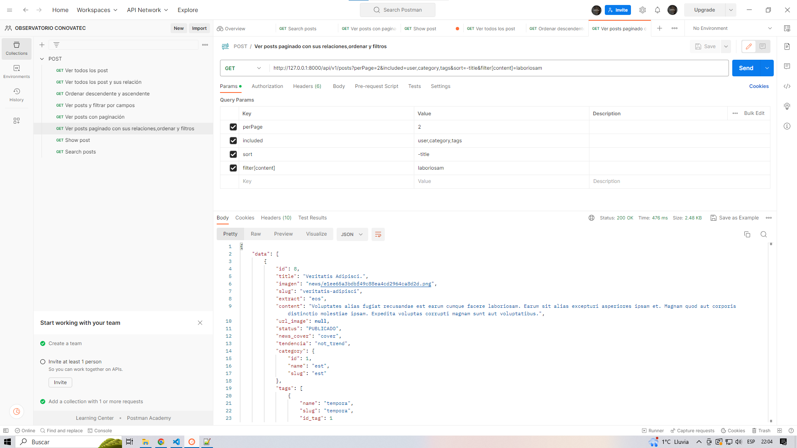

<div align="center">

<h1> CRUD API OBSERVATORIO JOVEN </h1>

[]()
[](https://github.com/kylelobo/The-Documentation-Compendium/issues)
[](https://github.com/kylelobo/The-Documentation-Compendium/pulls)
[](/LICENSE)

## 💬 Descripción del proyecto <a name="-descripción-del-proyecto-"></a>

<p>Este proyecto implementa una API RESTful en Laravel que permite realizar operaciones CRUD (Crear, Leer, Actualizar y Eliminar) en una base de datos. La API también incluye autenticación de usuarios y paginación de resultados para una mejor experiencia de usuario.

## 🥇 DEMO 🥇 <a name="-demo--"></a>

</p>
</div>

<div align="center">
<p align="center">
  <a href="" rel="noopener">
 </a>
</p>
</div>

---

<h2> 📝 Tabla de contenido </h2>

- [💬 Descripción del proyecto ](#-descripción-del-proyecto-)
- [🥇 DEMO 🥇 ](#-demo--)
- [💎 Tecnologías utilizados](#-tecnologías-utilizados)
  - [📖 Características ](#-características-)
  - [✒️ Clonar ](#️-clonar-)
  - [⌨️ Uso ](#️-uso-)
- [👨‍💻 Desarrollador](#-desarrollador)

## 💎 Tecnologías utilizados<a name="-tecnologías-utilizados"></a>

-   Este proyecto utiliza las siguientes tecnologías:

-   **Laravel** - un framework de PHP para aplicaciones web
-   **Tailwind CSS** - un framework de CSS para diseñar interfaces de usuario
-   **Alpine.js** - un framework de JavaScript para la capa de presentación
-   **Livewire** - una biblioteca de componentes para Laravel que permite construir interfaces de usuario dinámicas sin tener que escribir JavaScript

### 📖 Características <a name="-características-"></a>

Este proyecto incluye las siguientes características:

-   Operaciones CRUD (Crear, Leer, Actualizar y Eliminar) en una base de datos utilizando una API RESTful en Laravel
-   Autenticación de usuarios para proteger los endpoints de la API y restringir el acceso a ciertas partes de la aplicación solo para usuarios registrados y autenticados
-   Paginación de resultados para manejar grandes cantidades de datos de manera más eficiente y permitir al usuario navegar por los resultados de manera más fácil y rápida.

### ✒️ Clonar <a name="-clonar-"></a>

Clonar para usarlo en tu servidor local

```
git@github.com:CONOVATEC/observatorio-back.git
```

ó

```
https://github.com/CONOVATEC/observatorio-back.git
```

### ⌨️ Uso <a name="-uso-"></a>

-   En el terminal

    ```
    composer install
    cp .env.example .env
    php artisan key:generate
    ```

-   Crear tu base de datos
-   Cambiar los datos de usuario

    ```
    DB_DATABASE=observatorio
    DB_USERNAME=root
    DB_PASSWORD=
    ```

-   En el terminal
    ```
    php artisan migrate
    php artisan db:seed
    php artisan serve
    ```
-   Ver funcionamiento
    > `http://127.0.0.1:8000`
    -   Datos de acceso
    ```
    Email: admin@admin.com
    Contraseña: admin123
    ```
-   ## 🧑‍✈️ Implementación y Uso del API
    -   ### ⭐ API POST
        -   Ejemplos de uso
            -   Ver todos los posts
                ```
                http://127.0.0.1:8000/api/v1/posts
                ```
            -   Ver todos los posts paginado
                ```
                http://127.0.0.1:8000/api/v1/posts?perPage=2
                ```
            -   Ver todos los posts con sus respectivos relaciones
                -   Relaciones disponibles utilize **included=relación**
                    `user,category,tags,images`
                -   Uso
                    ```
                    http://127.0.0.1:8000/api/v1/posts?included=user,category,tags
                    ```
            -   Ver todos los posts - Ordenar ascedente o descendente
                -   campos disponibles utilize **sort=campo a ordenar**
                    `id, title, slug, extract, content, status, user_id`
                -   uso
                    ```
                    http://127.0.0.1:8000/api/v1/posts?sort=-title  Descendente
                    http://127.0.0.1:8000/api/v1/posts?sort=title   Ascedente
                    ```
            -   Ver todos los post - filtro por cada campo
                -   campos disponibles utilize **filter['campo a filtrar']=valor** puede utilizar varios campos separado por comas
                    `id, title, 'slug, extract, content`
                -   uso
                    ```
                    http://127.0.0.1:8000/api/v1/posts?filter[title]=le&filter[content]=le
                    ```
            -   Buscador de los posts utilice **search=valor a buscar**
                ```
                http://127.0.0.1:8000/api/v1/posts?search=ot
                ```
            -   Utilizando combinación entre paginación, relaciones,ordenación y filtro.
                ```
                http://127.0.0.1:8000/api/v1/posts?perPage=2&included=user,category,tags&sort=-title&filter[content]=laboriosam
                ```
            -   Ver un post por ID
                ```
                http://127.0.0.1:8000/api/v1/posts/50
                http://127.0.0.1:8000/api/v1/posts/50?included=tags,user,category
                ```

## 👨‍💻 Desarrollador<a name="-desarrollador"></a>

<div  align="center">

CONOVATEC

</div>

---

</br>
<div align="center">
<p align="center"> © 2023 OBSERVATORIO JOVEN</p>

</div>
